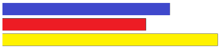

# Visualitation Mandatory Exercise
## The target of this script is to display a barchart using the refactor sample make in class

### 1) Add a padding between each of the chart bars.

This is the original


This is the target


**Solution**

```diff
function setupXScale(totalSales)
{
  x = d3.scaleBand()
    .rangeRound([0, width])
    .domain(totalSales.map(function(d, i) {
      return d.product;
    }))
+    .padding(0.1) //add a padding
}

```

### 2) Adding some color to each bar, based on the product Id

I add a new field to  data.json called 'color'

```json
[{ "product": "Pepinos", "sales": 6 , "color": "blue"},
{ "product": "Tomates", "sales": 2 , "color": "red"},
{ "product": "Pimientos", "sales": 10 , "color": "yellow"}]
```

**Solution**

and add .style to the rectangle with the color in the same way we use 'product' and 'sales'

```diff
Barchart=newRects.append('rect')
        .attr('x', function(d, i) {return x(d.product);})
        .attr('y', function(d) {return y(d.sales);})  
        .attr('width', x.bandwidth)
        .attr('height', function(d, i) {return (height - y(d.sales));})
++      .style('fill', function(d, i) {return (d.color)})
```

This is the result




### 3) Let's rotate 90º the bar chart, we want it to show it like:


First change a bit the canvasSize

```diff
function setupCanvasSize() {
--margin = {top: 0, left: 80, bottom: 20, right: 30};
++margin = {top: 50, left: 80, bottom: 100, right: 80};
  width = 960 - margin.left - margin.right;
--height = 120 - margin.top - margin.bottom;
++height = 550 - margin.top - margin.bottom;
}
```

Second let's swap X Scale and Y Scale

```diff
--function setupXScale()
++function setupYScale()
{
  var maxSales = d3.max(totalSales, function(d, i) {
    return d.sales;
  });

--  x = d3.scaleLinear()
++  y = d3.scaleLinear()
--    .range([0, width])
++    .range([height, 0])
    .domain([0, maxSales]);

}


--function setupYScale()
++function setupXScale()
{
--  y = d3.scaleBand()
++  x = d3.scaleBand()
--    .rangeRound([0, height])
++    .rangeRound([0, width])
    .domain(totalSales.map(function(d, i) {
      return d.product;
    }));
}

Third let´s change x,y,heigh and with atrributes in the Bars

function appendChartBars()
{

  var rects = svg.selectAll('rect')
    .data(totalSales);

    var newRects = rects.enter();

    newRects.append('rect')
--    .attr('x', x(0))
++    .attr('x', function(d, i) {return x(d.product);})
--    .attr('y', function(d, i) {return y(d.product);})
++    .attr('y', function(d) {return y(d.sales);})
--    .attr('height', y.bandwidth)
++    .attr('height', function(d, i) {return (height - y(d.sales));})
--    .attr('width', function(d, i) {return x(d.sales);});
++    .attr('width', x.bandwidth)
```

This is the result


### 4) Adding a legend

**Solution**

#### 4.1 Adding axis leyends

We need to add the text to the axis

```diff
function appendXAxis(totalSales) {
  svg.append("g")
    .attr("transform",`translate(0, ${height})`)
    .call(d3.axisBottom(x))
    
++  svg.append("text")             
++    .attr("transform",
++          "translate(" + (width/2) + " ," + 
++                         (height + margin.top + 20) + ")")
++    .style("text-anchor", "middle")
++    .text("Products");
}

function appendYAxis(totalSales) {
  // Add the Y Axis
  svg.append("g")
    .call(d3.axisLeft(y))
++svg.append("text")
++    .attr("transform", "rotate(-90)")
++    .attr("y", 0 - margin.left)
++    .attr("x",0 - (height / 2))
++    .attr("dy", "1em")
++    .style("text-anchor", "middle")
++    .text("Values");      
}
```
#### 4.1 Adding barchart leyend

Let's start by adding a new style for the new legend (styles.css)

```css
.legend {
  padding: 5px;
  font: 15px sans-serif;
}
```
and we add the function **appendLegend**

```javascript
function appendLegend(totalSales){

  legend = svg.append('g')
	  .attr('class', 'legend')
	  .attr('height', 100)
	  .attr('width', 100)
    .attr('transform',
       `translate(60,0)`)

  legend.selectAll('rect')
    .data(totalSales)
    .enter()
    .append('rect')
	  .attr('x', width - 65)
    .attr('y', (d, i)=> i *  20)
	  .attr('width', 10)
	  .attr('height', 10)
    .style('fill', (d)=> d.color)
    .style('stroke',"black")
      
  legend.selectAll('text')
    .data(totalSales)
    .enter()
    .append('text')
	  .attr('x', width - 52)
    .attr('y',(d, i)=> i *  20 + 9)
	  .text((d)=> d.product);
}
```

This is the result


